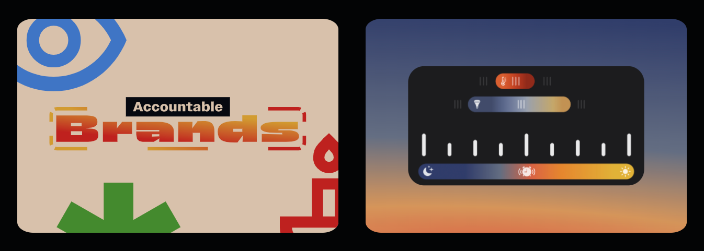

<h1 align="center">Portfolio</h1>
<h2 align="center">Alex Yang</h2>

A living selection of my development and design work, built as a Next.js app, and deployed as a static webpage with GitHub Actions + Pages.

